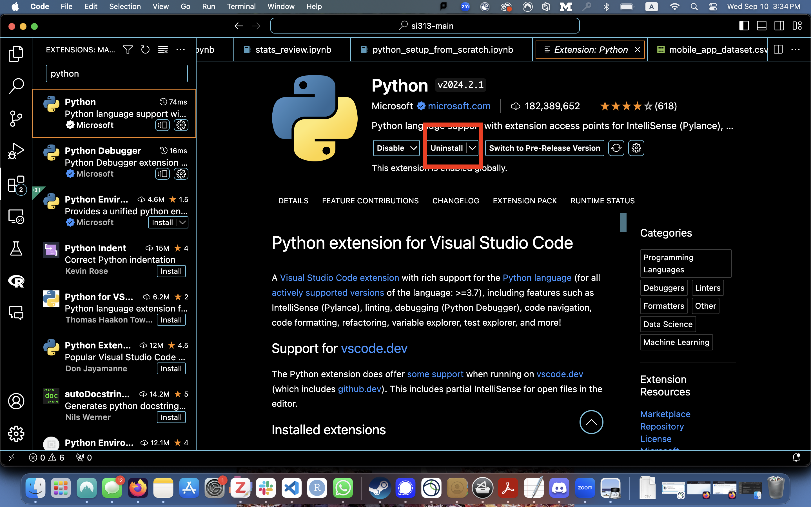
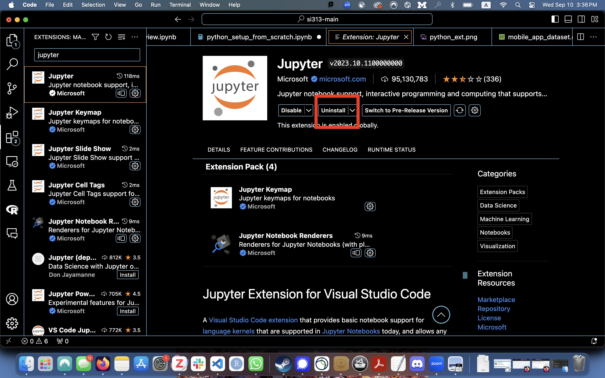
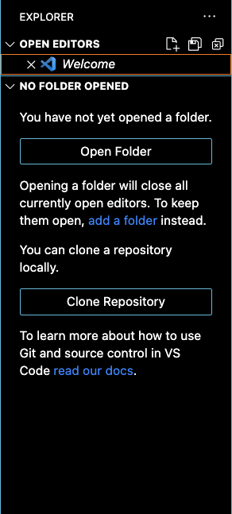
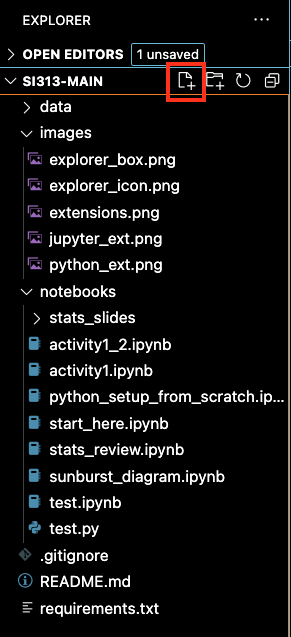
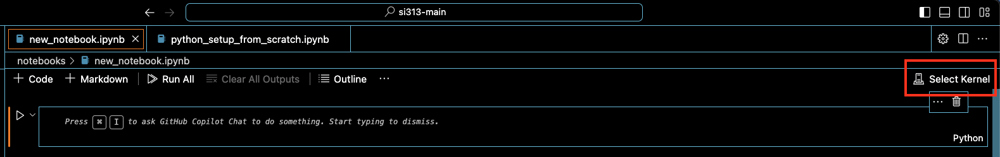

# Overview

Welcome! This repository hosts code and data used during in-class demos in SI 313: Introduction to Quantitative Methods. Many of the demos are Python versions of the demos and exercises provided in the class textbook:

> Chapman, C., Rodden, K. (2023). _Quantitative User Experience Research : Informing Product Decisions by Understanding Users at Scale_. Apress.

The original code and data that accompany the book are available at [the book's website](https://quantuxbook.com/index.html).

# Getting Started

We will (usually) assume that you're using VS Code to run your notebooks and code.

## Setting up VS Code

Here's a screen recording of me setting up my VS Code environment. First, I clone the repo, then I create a virtual environment and install the modules I need to run the code.

## Setting your paths

Before running any of the notebooks, you should start with [notebooks/start_here.ipynb](notebooks/start_here.ipynb) to make sure your path is setup correctly.

# Setting Up Python in VSCode

## Table of Contents

1. How to get Python and Jupyter extensions into VSCode
2. How to create a new Jupyter notebook file
3. How to create a virtual environment
4. How to install a Python interpreter

    4a. How to specify which module versions the interpreter should include
    
5. How to find out what a module can do/how to do what you want to do

## 1. How to get Python and Jupyter extensions into VSCode

Step 1. Go to Extensions tab on left-side of VSCode 

Step 2. Search for the Python extension from Microsoft and install

Step 3. Search for the Jupyter extension from Microsoft and install

## 2. How to create a new Jupyter notebook file

Step 1. Select the Explorer on the left of VSCode

Step 2. Open a folder/directory if none appears in the Explorer box 

Step 3. Mouse over the directories in the Explorer box

Step 4. Click the page with a plus icon to create a file and input a name ending with the Jupyter notebook file extension (ex. "filename.ipynb")

## 3. How to create a virtual environment

Step 0. Why to create a virtual environment
- A virtual environment helps with switching between versions of modules across projects and protecting your base interpreters from corrupted files or conflicting versions

Step 1. In a new Jupyter notebook file, click "Select Kernel" in top right of VSCode

Step 2. Select "Select Another Kernel..."

Step 3. Select the plus line that says "Create Python Environment" 

Step 4. Select "Venv" to create a virtual environment

Step 5. Select desired Python interpreter (version of Python, see 4.)

## 4. How to install a Python interpreter (depends on Mac vs. Windows/Linux)

### If Mac, 
Step 1. Visit <a href="https://brew.sh/">Homebrew webpage</a> and follow instructions to install

Step 2. Install a version of Python (ideally 3.12 or later) using "brew install python" in Terminal

### If Windows/Linux,
Step 1. Visit  <a href="https://www.python.org/downloads/">Python webpage</a>

Step 2. Download appropriate .exe file, then run once downloaded

Step 3. Note filepath where Python is installed to

## 4a. How to specify which module versions the interpreter/virtual environment should include
- When creating the virtual environment, after selecting the desired Python interpreter, select a textfile with module versions specified
- For this class, we'll use the versions in requirements.txt

